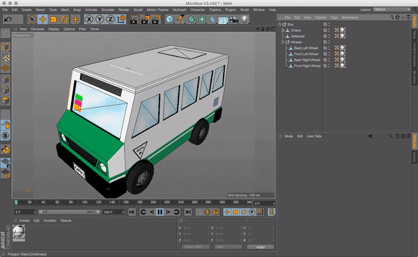
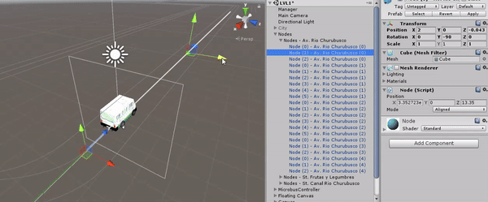

<p align="center"> 
  
</p>

[](https://javier-games.itch.io/cafre)

# Cafre

The runner mobile game where you take on the role of a public transportation driver in Mexico City, 
one of the most chaotic and crowded cities in the world. Your mission is to complete your route without destroying 
your vehicle, help passengers reach their destinations, and earn good money. But be careful—among the passengers, 
there are bad guys ready to rob you!

> **Disclaimer**
> 
> The term _"Cafre"_ used in the game refers to a colloquial Mexican expression that describes aggressive or uncouth 
> behavior, particularly in the context of driving. This usage is intended to reflect the challenging and chaotic
> nature of the driving experience in Mexico City.
> 
> We want to clarify that the game’s use of this term is in no way intended to convey any form of racism,
> classism, or discrimination. Our goal is to provide an engaging and immersive experience, and we are committed 
> to ensuring that the game's content is respectful and inclusive.
> 
> Please note that this game does not promote acts of violence or criminal behavior. The inclusion of thieves and 
> other challenging elements is intended solely for gameplay purposes and does not endorse or condone real-world 
> delinquency. We hope that such issues diminish in the future and encourage positive and respectful interactions 
> in real life.

# Development 
 
This project was developed as part of the "Diplomado en Diseño y Programación de Videojuegos" a diploma 
program focused on video game design and programming handled by the National Autonomous University 
of Mexico during 2017. 

<p align="center"> 
  
</p>
 
# Features 
 
## Navigation 
 
To achieve smooth yet controlled movement on the streets, the game implements a node-based system for generating 
Bézier curves. This allows the vehicle to seamlessly follow and switch between different paths. Players can  
change lanes by swiping right or left, giving them intuitive control over the vehicle's direction. 

<p align="center"> 
  
</p>
 
## Collectables 
 
In the current iteration of the game, a collectible system is implemented to support a basic coin collection  
mechanic. This system is designed to be easily expandable, allowing for the integration of power-ups and  
additional collectibles in future updates. 

<p align="center">
  
  
  
</p>
 
## Passengers Pick Up & Drop Off 
 
A core mechanic of the game involves collecting and delivering passengers to their destination. Once a passenger  
is picked up, an exclamation mark will appear above the vehicle to indicate that they wish to exit.  
If you fail to let them out promptly, they will start to scream, with dialogue balloons gradually covering  
the screen until you allow them to disembark. 
 
To pick up or drop off passengers, you need to make a brief stop by swiping down and position your vehicle  
close to the right sidewalk. This interaction ensures an engaging and responsive experience as you manage 
passenger needs while navigating the streets. 
 
## Thief Passengers 
 
In Mexico City, some thieves may disguise themselves as regular passengers. In the game, if you identify a  
thief, you'll need to make a sudden move to eject them from your vehicle. Failure to do so will result in  
the thief stealing your money, adding an extra layer of challenge and realism to your driving experience. 

# Requirements

- [Unity 2017.1.1f1](https://unity.com/releases/editor/whats-new/2017.1.1#installs)

> This project was made using some assets from the official [Unity Asset Store](https://assetstore.unity.com/)
> and are not included in this public repository. Please get the official assets in the links below.

- [Character Pack: Free Sample](https://assetstore.unity.com/packages/3d/characters/humanoids/character-pack-free-sample-79870)
- [Huge FBX Mocap Library part 1](https://assetstore.unity.com/packages/3d/animations/huge-fbx-mocap-library-part-1-19991)
- [Raw Mocap Data for Mecanim](https://assetstore.unity.com/packages/3d/animations/raw-mocap-data-for-mecanim-5330)
- [SimplePoly World](https://assetstore.unity.com/packages/3d/environments/simplepoly-world-low-poly-assets-73353)
- [~~Lean Touch v1~~](https://assetstore.unity.com/packages/tools/input-management/lean-touch-30111) (Replaced with custom controller)

## Deployment

- [Android Studio 3.0](https://developer.android.com/studio/archive)
- [Android SDK 4.1 Jelly Bean](https://developer.android.com/tools/releases/platforms#4.1)
- [Java Development Kit 8](https://www.oracle.com/java/technologies/downloads/?er=221886)
- [Xcode 9.2](https://developer.apple.com/services-account/download?path=/Developer_Tools/Xcode_9.2/Xcode_9.2.xip)


# Project Installation

To set up and run the Cafre game project, follow these steps:

1. Open your terminal or command prompt.
2. Clone the repository using the following command:
    ```bash
    git clone https://github.com/javier-games/poc-cafre.git
    ```
3. Open the project.
4. Switch to Android of iOS platform.
5. Select the `Menu` scene.

# Game Installation

1. Download the APK 
   - Download the APK file from the [itch.io](https://javier-games.itch.io/cafre) official site.
2. Enable Installation from Unknown Sources
   - Go to your device's Settings > Security (or Privacy).
   - Enable Unknown Sources or Install unknown apps. This allows you to install apps from sources other than the Google Play Store.
3. Install the APK
   - Open your device's File Manager and locate the downloaded APK file.
   - Tap on the APK file to start the installation process.
   - Follow the on-screen prompts to complete the installation.
4. Launch the Game
   - Once installed, tap the Cafre icon on your home screen or app drawer to launch the game.
   - Start playing and enjoy the experience!


# License

This project is licensed under the GNU General Public License v3.0. See the [LICENSE](LICENSE.txt) file for details.
